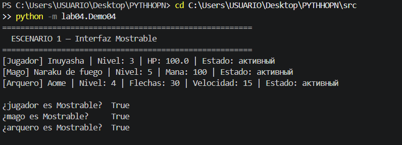
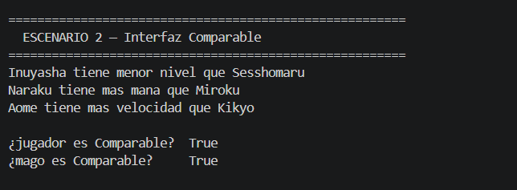
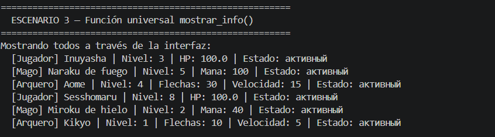
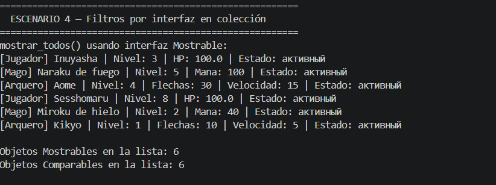
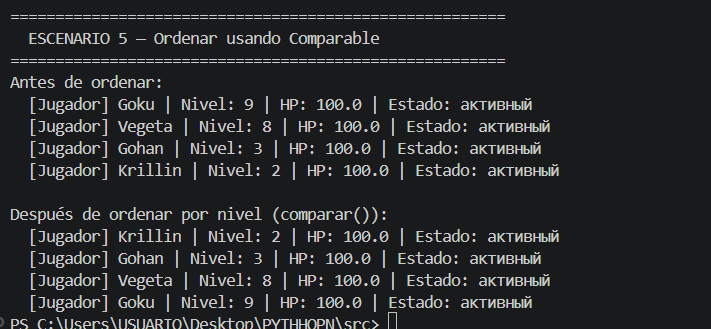

# 1. Цель работы

В этой лабораторной я познакомилась с абстрактными классами и интерфейсами. Объясню своими словами что это такое.

### Абстрактный класс
>то как шаблон с обязательными требованиями. Сам по себе он ничего не делает и создать объект из него нельзя. Он просто говорит: если хочешь быть частью системы — реализуй вот это. Это как franquicia de restaurante — каждый повар обязан уметь готовить, убирать и принимать заказы. Как именно — его дело. Но эти три вещи должны быть у всех.

### Интерфейс
> Это чистый список обязательств и больше ничего. Как договор при устройстве на работу — подписал, значит обязан выполнять.

# 2. Какие интерфейсы я создала

Я создала два интерфейса.

### Первый —> Mostrable (Показываемый)
>любой класс который его реализует, обязан уметь показывать информацию о себе. Это удобно — если у всех гарантированно есть этот метод, можно просто пройти по списку и вызвать его. Не нужно проверять кто есть кто.

### Второй —>COmparable (Сравниваемый)
>любой класс который его реализует, обязан уметь сравнивать себя с другим объектом. Каждый делает это по-своему — обычный игрок сравнивает по уровню, маг сравнивает по мане, лучник по скорости.

# 3. Как классы реализуют интерфейсы

Все три типа игроков — обычный, маг и лучник — реализуют оба интерфейса. Метод показа и метод сравнения есть у каждого, но работают они по-разному.

Обычный игрок показывает имя, уровень, здоровье и состояние. Маг добавляет к этому ману и тип магии. Лучник добавляет количество стрел и скорость.

При сравнении все трое смотрят на уровень, но если уровни одинаковые — каждый уточняет свою особенность.

# 4. Демонстрация работы

### Сценарий 1 — Интерфейс "Показываемый"

>Создаются три игрока разных типов. Для каждого вызывается метод показа — одно и то же название метода, но разный результат. Также проверяется что каждый объект реализует интерфейс.

### Сценарий 2 — Интерфейс "Сравниваемый"

 >Создаются ещё три игрока и каждый сравнивается с похожим. Маг сравнивается с магом, лучник с лучником. Каждый сравнивает по своей характеристике. Также проверяется принадлежность к интерфейсу.

### Сценарий 3 — Универсальная функция через интерфейс

>Создаётся функция которая принимает любой список объектов и выводит информацию о каждом через метод показа. Ей всё равно кто там внутри — маг, лучник или обычный игрок. Просто вызывает метод и каждый сabe que hacer.

### Сценарий 4 — Фильтрация коллекции по интерфейсу

 >В коллекцию добавляются шесть игроков разных типов. Коллекция выводит всех через метод показа, потом фильтрует — отдельно те кто реализует первый интерфейс, отдельно второй.

### Сценарий 5 — Сортировка через интерфейс "Сравниваемый"

>Создаётся список из четырёх обычных игроков в случайном порядке. Выводится список до сортировки, затем коллекция сортируется используя метод сравнения, и список выводится снова — уже по уровню от меньшего к большему.

# 5. Вывод

Раньше казалось что интерфейсы — это лишнее. Но смысл в том что они дают гарантию. Ты знаешь что у любого объекта который реализует интерфейс — нужный метод точно есть. Не нужно проверять тип, не нужно писать условия. Просто вызываешь и каждый объект сам разбирается что делать.