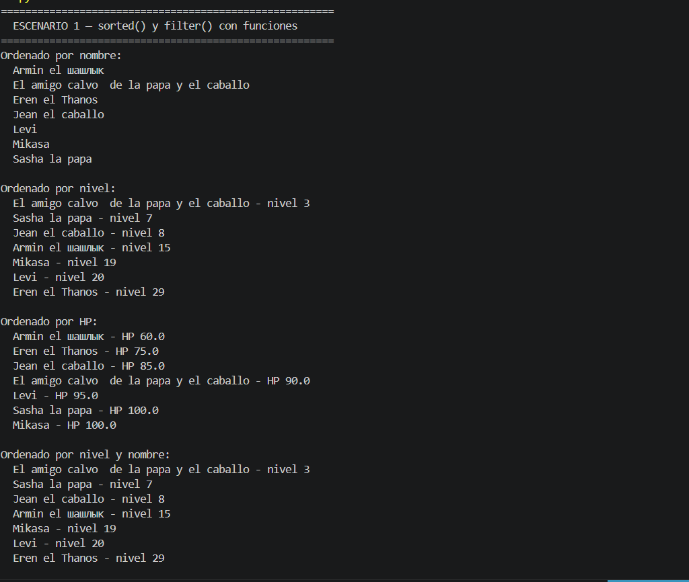
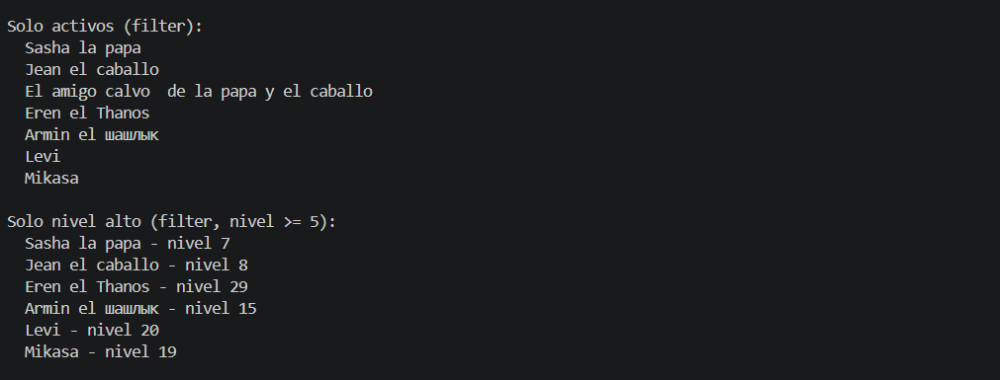
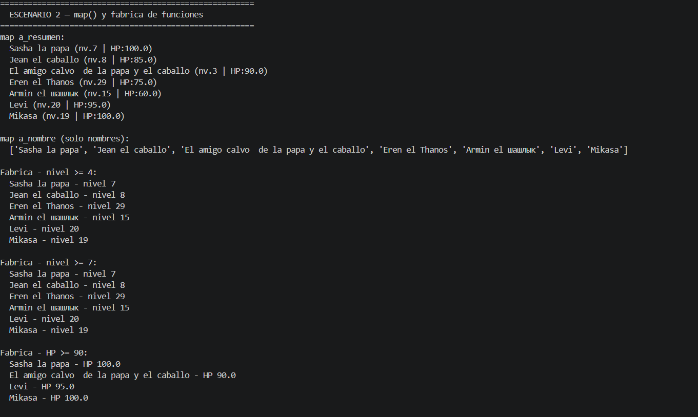
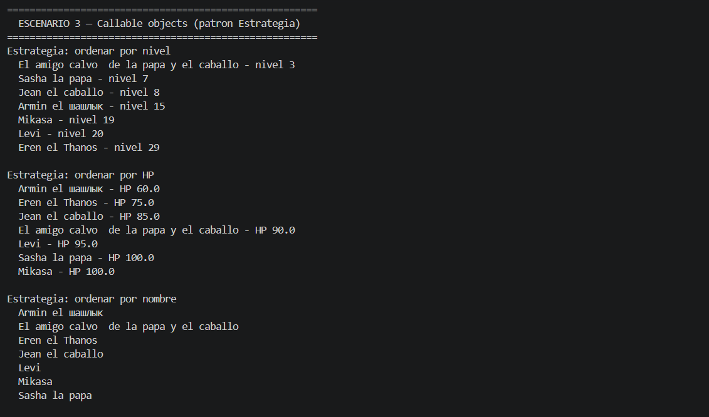
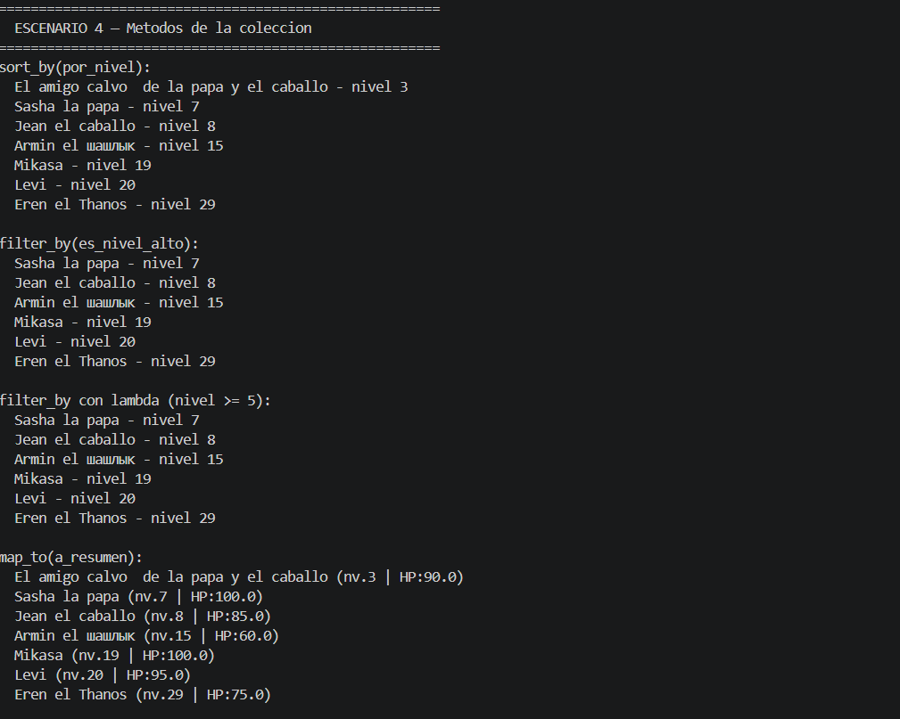
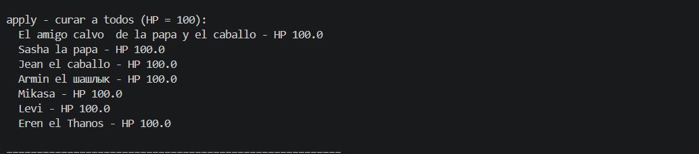
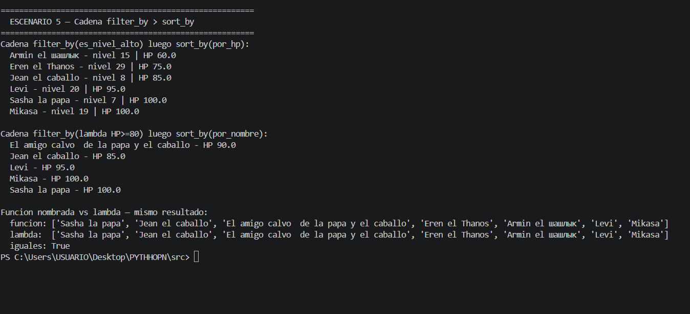

### Цель работы
Cуть в том, что в Python функцию можно передать в другую функцию как обычное значение — как число или строку. И это меняет очень многое. Вместо того чтобы писать десять похожих методов, пишешь один — и просто говоришь ему что делать, передавая нужную функцию снаружи.

### Что реализовано
#### Функции для сортировки
Я написала три простые функции — каждая возвращает один атрибут игрока: имя, уровень или здоровье. Они передаются в метод сортировки коллекции. То есть коллекция не знает заранее по чему сортировать — ей это говорят снаружи. Хочу по имени — передаю одну функцию. Хочу по уровню — передаю другую. Код коллекции не трогаю вообще.
#### Функции-фильтры
Два фильтра: один проверяет активен ли игрок, второй проверяет высокий ли уровень. Передаются во встроенную функцию которая проходит по списку и оставляет только тех кто прошёл проверку. Мне понравилось что это очень читаемо — сразу понятно что происходит.
#### Фабрика функций
Вот это мне показалось самым интересным. Это функция которая внутри себя создаёт другую функцию и возвращает её. Например: хочу фильтровать игроков с уровнем выше 3 — вызываю фабрику с числом 3 и получаю готовый фильтр. Хочу фильтровать с уровнем выше 7 — вызываю с числом 7. Одна фабрика, сколько угодно разных фильтров. Не нужно писать отдельную функцию для каждого случая — фабрика делает это за тебя.
#### Паттерн «Стратегия»
Это классы которые можно вызывать как будто они функции. Я создала три: одна лечит мёртвых игроков, другая наносит урон, третья даёт опыт. Все три работают одинаково снаружи — их просто передают в метод коллекции. Хочу нанести урон — передаю стратегию урона. Хочу дать опыт — передаю стратегию опыта. Код коллекции не меняется вообще — это и есть главная идея паттерна.
Это похоже на то как в ресторане работает один и тот же официант, но блюда готовит разный повар в зависимости от заказа. Официант не меняется — меняется только кто готовит.
Новые методы коллекции
Коллекция получила четыре новых метода. Сортировка по переданной функции, фильтрация по переданной функции, применение функции ко всем элементам, и преобразование всей коллекции в список результатов.
### Демонстрация работы
#### Сценарий 1 — Цепочка filter -> sort -> apply
Коллекция из шести игроков. Одного убиваем чтобы фильтрация была интересной. Потом шаг за шагом: сначала отфильтровываем только живых, потом сортируем их по уровню, потом наносим урон всем через стратегию. После каждого шага выводим результат — видно как коллекция меняется.

#### Сценарий 2 — Меняем стратегию не трогая коллекцию
Одна и та же коллекция. Сортируем по имени — получаем один порядок. Сортируем по здоровью — другой. По уровню — третий. Один метод, три разные функции, три разных результата. То же самое с фильтрами — используем и готовые функции и те что создала фабрика. Это показывает в чём вообще смысл всего этого.

#### Сценарий 3 — Callable-объекты
Двух игроков убиваем. Выводим состояние. Применяем стратегию-объект который лечит мёртвых — они оживают. Потом берём только живых и даём им опыт через другой объект-стратегию. Весь смысл в том что объект передаётся точно так же как обычная функция — разницы снаружи не видно.

#### Сценарий 4 — map() и lambda
Показываю как преобразовать всю коллекцию в список строк. Сначала через именованную функцию, потом то же самое через lambda в одну строку — результат одинаковый. Lambda это просто короткая анонимная функция которую не нужно называть если используется один раз.

#### Сценарий 5 — Фабрика в деле
Вызываю фабрику три раза с разными числами — получаю три разных фильтра. Применяю каждый к коллекции и смотрю результат. Удобно что не нужно писать три отдельные функции — одна фабрика справляется со всем.

### Вывод
До этой лабораторной я думала про функции как про что-то статичное — написала, вызвала, готово. Теперь понимаю что их можно передавать как данные, создавать внутри других функций и использовать как настройку поведения.
Паттерн стратегии мне понравился больше всего — это очень практичная идея. Когда логика приходит снаружи, код внутри становится чище и его легче менять. Не нужно лезть в коллекцию каждый раз когда хочешь поменять как она работает — просто передаёшь другую функцию.